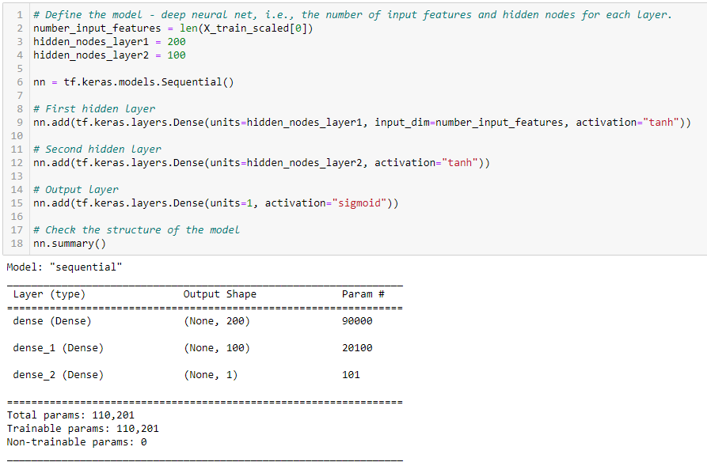

# Neural Network Charity Analysis - Module 20 Challenge
UNC Chapel Hill Data Analytics Bootcamp

## Overview of Project
For Module 20, Scikit-learn, TensorFlow, and Python were used in Jupyter Notebook to model deep-learning neural networks. The goal was to create a binary classifier capable of predicting whether or not applicants will be successful if funded by Alphabet Soup.

## Method & Results
### Preprocessing the Data for a Neural Network Model
In order to effectively use the given dataset, it was cleaned and reformatted to better work with machine learning. Non-beneficial columns, like `EIN` and `NAME`, which have no effect on a successful application, were dropped. Since the `INCOME_AMT` was originally a range, it was converted into separate columns, each with an income range (i.e. 1-9,999; 10,000-14,999; etc.). Other columns with ranges were treated similarly. 

### Compile, Train, and Evaluate the Model
* What variable(s) are considered the target(s) for your model?
  * `IS_SUCCESSFUL` variable is the target; it indicates whether or not the charity was successful, and the model is attempting to predict which charities are and are not successful.
* What variable(s) are considered to be the features for your model?
  * `NAME`, `APPLICATION_TYPE`, `AFFILIATION`, `CLASSIFICATION`, `USE_CASE`, `INCOME_AMT`, and `SPECIAL_CONSIDERATIONS`. Although the original model did not consider the `NAME` column to be of importance, some charities with the same name applied often enough to skew the dataset, making it an important factor in mapping trends in the data and predicting success.
 

  
List of feature variables before binning

  
  
  

  
List of feature variables after binning

  
  
  

* What variable(s) are neither targets nor features, and should be removed from the input data?
  * `EIN` was removed from the dataset because it is a unique identification number that differs for every charity and has no effect on a charity's rate of success or failure.

### Optimize the Model
* How many neurons, layers, and activation functions did you select for your neural network model, and why?
  * The model contained two hidden node layers; layer 1 had 200 nodes and layer 2 had 100 nodes. The activation functions were kept as Tanh, but the epochs were changed to 100. The hidden node counts, layer counts, and activation functions remained the same as the original file because changing them produced little to no difference in the accuracy score.

  
Model details

  
  
  

* Were you able to achieve the target model performance?
  * Yes; accuracy with the last model was 78.8%.

  
Original model accuracy

  
  
  

  
Optimized model accuracy

  
  
  

* What steps did you take to try and increase model performance?
  * Although many steps were taken to increase model performance, such as adding node layers, changing the number of hidden nodes per layer, and changing the bin thresholds, the largest impact was from keeping the `NAME` column and adding it to the list of variables to be binned. The number of epochs was also increased from 50 to 100 for increased training time. The other listed changes had such a small effect on the final loss and accuracy scores - and, in some cases, increased loss and decreased accuracy - that they were reverted to the original values.

## Summary
After optimization, the model can predict the success rate of Alphabet Soup applicants with 78.8% accuracy. If the process were to be repeated with a different model, it may be beneficial to test it with the Random Forest Classifier, as it is less prone to bias and overfitting.
